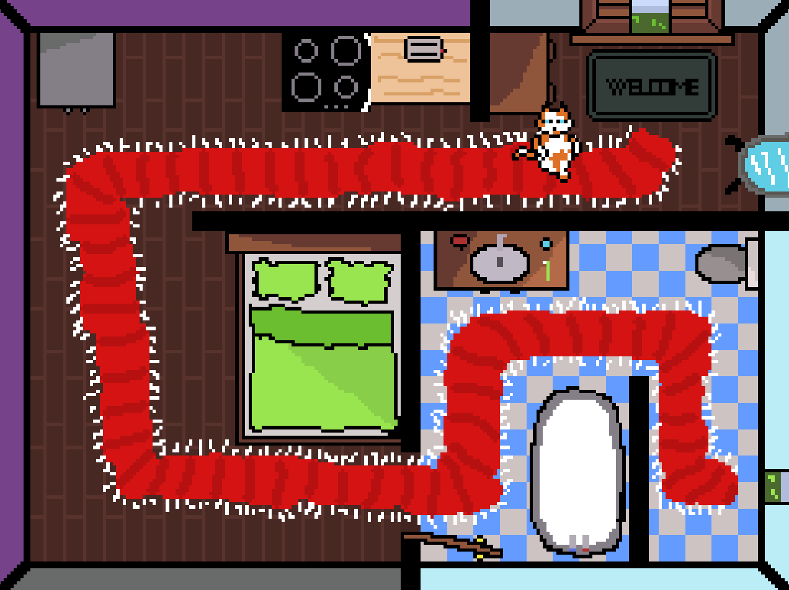
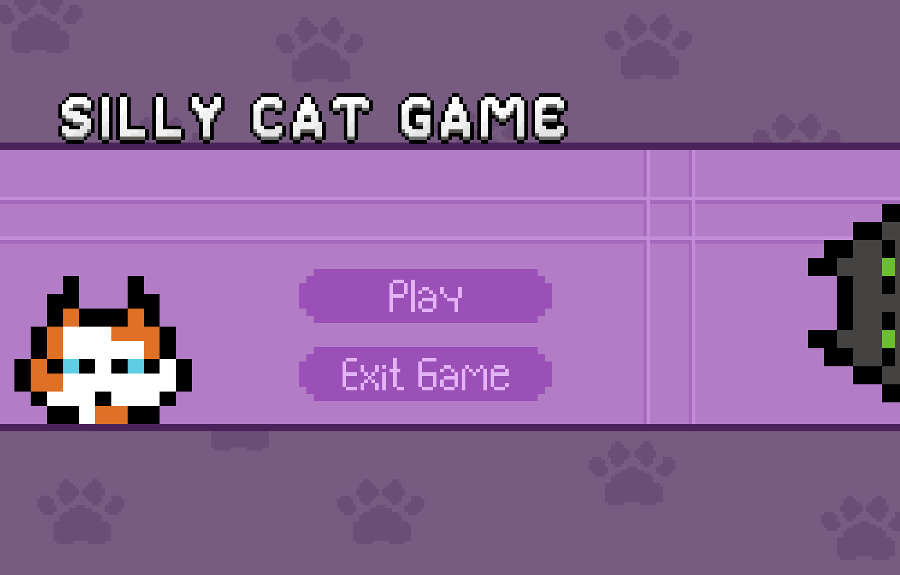
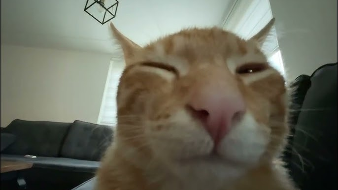

# SILLY CAT GAME

Basic silly cat themed tower defense strategy game built using **Python, PyGame library**.
Place down towers that definitely **DO NOT KILL ANY CATS**, and defend your base from the incoming waves of sillies.

## Features
- **Basic Graphics**: Simple yet charming graphics that fit the theme.
- - **Silly Cat Theme**: Enjoy a light-hearted, cat-themed game with cute graphics.
- - **Custom Font**: A custom font is used for the UI to enhance the visual appeal.
- **Lightweight**: The game is lightweight and can run on low-end machines.
- **Simple Mechanics**: Easy to understand and play, suitable for all ages.
- - **Tower Placement**: Place towers on the map to defend against incoming enemies.
- - **Wave Progression**: Each wave increases in difficulty, providing a challenge for players.

## Screenshots





## How to Play
- Click a tower in the toolbar to select it.
- Click on the map to place a tower (if it's a valid location).
- Click the **HUGE** green _START_ button to begin/pause a round. 
- Earn money by completing waves.
- Survive waves of silly cats to win!

## Project Structure
```
.
├── assets
│   ├── enemies
│   ├── towers
│   ├── ui
│   └── other
├── enemies
│   ├── enemy.py
│   ├── tabby.py
│   ├── black.py
│   ├── rolling.py
│   └── boss.py
├── towers
│   ├── tower.py
│   ├── crossbow.py
│   ├── cannon.py
│   └── projectile.py
├── font.py
├── mainmenu.py
├── game.py
└── main.py
```

## Thanks for Playing! :)
